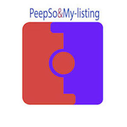

# Wordpress-plugin
integration plugin for Wordpress , the objective of this puling is connect two plugins My-Listing and Peepso and make more strong the Waterspot community. 

# wordpress-plugin
### Featured
* Community admin can enable/disable activity sync from listings.
* Every post includes a featured photo, Title, Autor, description of the listing.
* Confirmation of every post created.

Peepso
======
Peepso a social community plugin, it permits create and manage one or more communities in your webpage,  is very similar to Facebook ,  you have friends , you can publish posts and have an “activity” page where you can see posts and photos or videos who are posted for all the members of the community, hare I need to create one post every time one post was approved , integrating both plugins . [Peepso](https://peepso.com). 

### More information
* [Plugin Web Page](https://blog.alvararias.se/docs/peepso-my-listing/) All the information about the plugin.
* [Plugin Documentation Web Page](https://blog.alvararias.se/docs/peepso-my-listing/documentation/g/) Documentation and requeriments for the information about the plugin.

